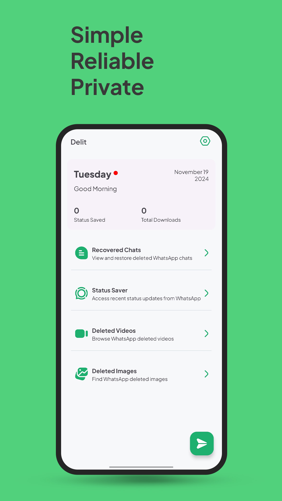
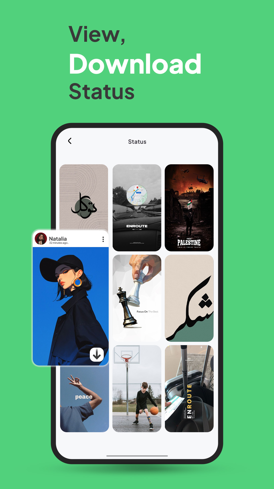
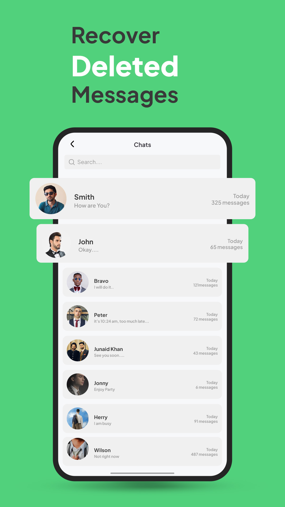

# Delit: WhatsApp Deleted Data Recovery

Effortlessly manage your WhatsApp data with our all-in-one app! 🚀  
Save and organize WhatsApp statuses, track and recover deleted messages, and retrieve images and videos for quick access.  
Need to message someone on WhatsApp without saving their contact? We've got you covered!  

Stay in control of your data with a simple, user-friendly solution.  

---

## Screenshots
### App Home  


### Status Saver  


### Deleted Messages  


---

## Features
- **WhatsApp Status Saver**: Save statuses from your contacts for later viewing.  
- **Deleted Message Recovery**: Recover and view messages deleted by senders.  
- **Image and Video Retrieval**: Restore media files quickly and easily.  
- **Direct Message**: Send WhatsApp messages without saving the recipient's contact.  

---

## Installation
1. Clone the repository:  
   ```bash
   git clone https://github.com/devzain-star/Delit-WhatsApp-Deleted-Data-Recovery.git
